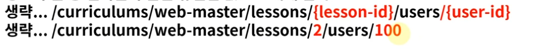

# URI
인터넷에서 특정 자원을 나타내는 주소 값. 해당 값은 유일하다.

# URL
인터넷 상에서의 자원, 특정 파일이 어디에 위치하는지 식별하는 주소
 

URL은 URI 하위 개념 입니다.

URI 설계 우너칙
* 슬래시 구분자는 계층 관계를 나타나는 데 사용한다.
* URI 마지막 문자는 /는 포함하지 않는다.
* 하이픈은 가독성을 높이는데 사용한다.
* 밑줄(_)을 사용하지 않는다.
* URI 경로에는 소문자가 적합하다.
* 파일 확장자는 URI에 포함하지않는다.
* 프로그래밍 언어에 의존적인 확장자를 사용하지 ㅇ낳는다.
* 구현에 의존적인 경로를 사욯하지 않는다.
* 세션 ID를 포함하지 않는다.
* 프로그래밍 언어의 method명을 이용하지 않는다.
* 명사에 단수형 보다는 복수형을 사용해야 한다. 컬렉션에 대한 표현은 복수로 사용
* 컨트롤러 이름으로는 동사나 동사구를 사용한다. 
* 경로 부분 중 변하는 부분은 유일한 값으로 대체 한다.

* CRUD 기능을 나타내는 것은 URI에 사용하지 않는다.

